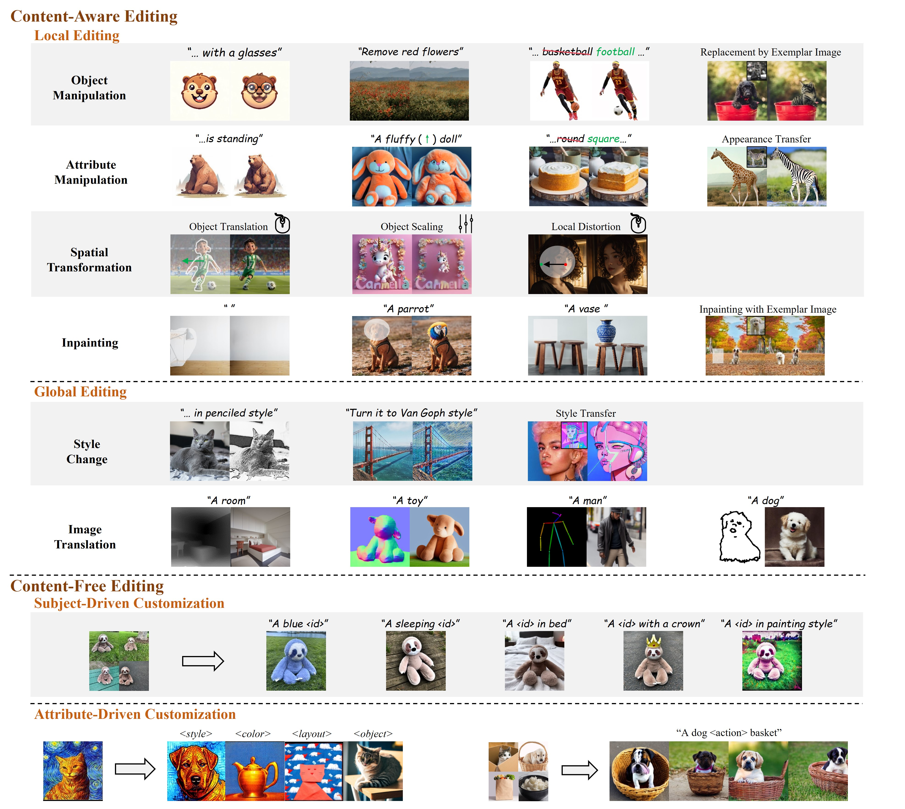
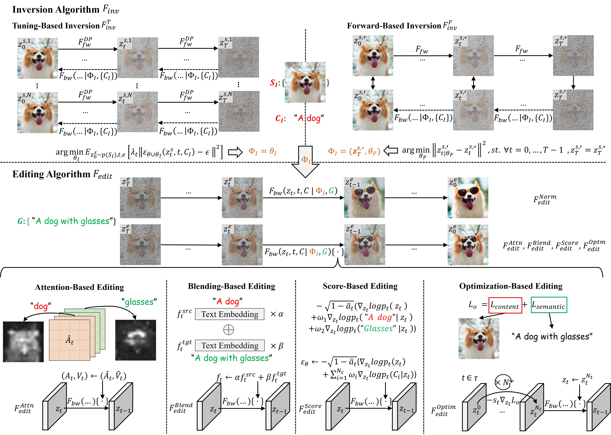

[](https://github.com/sindresorhus/awesome)
[](https://github.com/xinchengshuai/Awesome-Image-Editing/pulls)
<br />
<p align="center">
  <h1 align="center">A Survey of Multimodal-Guided Image Editing with Text-to-Image Diffusion Models</h1>
  <p align="center">
    <!-- arXiv, 2024 -->
    <!-- <br /> -->
    <a href="https://github.com/xinchengshuai"><strong>Xincheng Shuai</strong></a>
    ·
    <a href="https://henghuiding.github.io/"><strong>Henghui Ding</strong></a>
    ·
    <a href="http://xingjunma.com/"><strong>Xingjun Ma</strong></a>
    ·
    <a href="https://rongchengtu1.github.io/"><strong>Rongcheng Tu</strong></a>
    ·
    <a href="https://scholar.google.com/citations?user=f3_FP8AAAAAJ&hl=en"><strong>Yu-Gang Jiang</strong></a>
    ·
    <a href="https://scholar.google.com/citations?user=RwlJNLcAAAAJ"><strong>Dacheng Tao</strong></a>
    ·
  </p>

  <p align="center">
    <a href='https://arxiv.org/abs/2406.14555'>
      
    </a>
    <!-- <a href='' style='padding-left: 0.5rem;'>
      
    </a> -->
  </p>
<br />

This repo is used for recording and tracking recent multimodal-guided image editing methods with T2I models, as a supplement to our [survey](https://arxiv.org/abs/2406.14555).  
If you find any work missing or have any suggestions, feel free
to [pull requests](https://github.com/xinchengshuai/Awesome-Image-Editing/pulls).
We will add the missing papers to this repo ASAP.
 
<!-- We categorize the reviewed papers by their editing scenario, and illustrate their inversion and editing algorithms. -->


 <!-- ### 🔥News -->


### 🔥Highlight!!
[1] Two concurrent works ([Huang et al.](https://arxiv.org/abs/2402.17525), [Cao et al.](https://arxiv.org/abs/2403.04279)) are related to our survey. Huang et al. introduce the application of diffusion models in image editing, while Cao et al. focus on the controllable image generation. Compared to the review from Huang et al. and other previous literature, we investigate the image editing in a more general context. Our discussion extends beyond low-level semantics, encompassing customization tasks that align with our topic. We integrate existing general editing methods into a unified framework and provide a design space for users through qualitative and quantitative analyses.

[2] In this repo, we organize the reviewed methods based on the editing task and present their inversion & editing algorithms along with guidance set. It's worth noting that many of these studies employ multiple editing algorithms simultaneously. For simplicity, we have currently only indicate the primary technology they use. 


[3] We hope our work will assist researchers in exploring novel combinations within our framework, thereby enhancing performance in challenging scenarios.


## Editing Tasks Discussed in Our Survey
<p align="center">
  
</p>

## Unified Framework
<p align="center">
  
</p>


## Notation
Inversion Algorithm:
- $F_{inv}^{T}$: Tuning-Based Inversion.
- $F_{inv}^{F}$: Forward-Based Inversion.

Editing Algorithm:
- $F_{edit}^{Norm}$: Normal Editing.
- $F_{edit}^{Attn}$: Attention-Based Editing.
- $F_{edit}^{Blend}$: Blending-Based Editing.
- $F_{edit}^{Score}$: Score-Based Editing.
- $F_{edit}^{Optim}$: Optimization-Based Editing.

## Table of contents
Content-Aware Editing
- [Object Manipulation + Attribute Manipulation](#object-and-attribute-manipulation)
- [Attribute Manipulation](#attribute-manipulation)
- [Spatial Transformation](#spatial-transformation)
- [Inpainting](#inpainting)
- [Style Change](#style-change)
- [Image Translation](#image-translation)

<br>

Content-Free Editing
- [Subject-Driven Customization](#subject-driven-customization)
- [Attribute-Driven Customization](#attribute-driven-customization)

<br>

Experiment and Data
- [Data](#data)

<br>

## Object and Attribute Manipulation
### 1. Training-Free Approaches
| Publication |    Paper Title     |    Guidance Set      | Combination                                                                                                            | Code/Project                                                 |
|:----:|-----------------------------------------------------------------------------------------------------------------------|:---------------:|:-------:|--------------------------------------------------------------|
| TOG 2023 | [UniTune: Text-Driven Image Editing by Fine Tuning a Diffusion Model on a Single Image](https://arxiv.org/abs/2210.09477) |    text     | $F_{inv}^T+F_{edit}^{Norm}$|[Code]()|
| Arxiv 2023 | [Highly Personalized Text Embedding for Image Manipulation by Stable Diffusion](https://arxiv.org/abs/2303.08767) |    text     | $F_{inv}^T+F_{edit}^{Norm}$|[Code](https://github.com/HiPer0/HiPer)|
| CVPR 2024 | [Focus on Your Instruction: Fine-grained and Multi-instruction Image Editing by Attention Modulation](https://arxiv.org/abs/2312.10113) |    instruction     | $F_{inv}^T+F_{edit}^{Attn}$|[Code](https://github.com/guoqincode/Focus-on-Your-Instruction)|
| CVPR 2023 | [Imagic: Text-Based Real Image Editing with Diffusion Models](https://arxiv.org/abs/2210.09276) |    text     | $F_{inv}^T+F_{edit}^{Blend}$ |[Code]()|
| Arxiv 2023 | [Forgedit: Text Guided Image Editing via Learning and Forgetting](https://arxiv.org/abs/2309.10556) |    text     | $F_{inv}^T+F_{edit}^{Blend}$ |[Code](https://github.com/witcherofresearch/Forgedit)|
| CVPR 2024  | [Doubly Abductive Counterfactual Inference for Text-based Image Editing](https://arxiv.org/abs/2403.02981) |  text  | $F_{inv}^T+F_{edit}^{Blend}$ |[Code](https://github.com/xuesong39/DAC)|
| CVPR 2024 | [ZONE: Zero-Shot Instruction-Guided Local Editing](https://arxiv.org/abs/2312.16794) |    instruction     | $F_{inv}^T+F_{edit}^{Blend}$|[Code](https://github.com/lsl001006/ZONE)|
|CVPR 2023 | [SINE: Sinle Image Editing with Text-to-Image Diffusion Models](https://arxiv.org/abs/2212.04489) |  text  | $F_{inv}^T+F_{edit}^{Score}$ |[Code](https://github.com/zhang-zx/SINE)|
|CVPR 2023 | [EDICT: Exact Diffusion Inversion via Coupled Transformations](https://arxiv.org/abs/2211.12446) | text   | $F_{inv}^F+F_{edit}^{Norm}$ |[Code](https://github.com/salesforce/EDICT)|
|Arxiv 2023 | [Exact Diffusion Inversion via Bi-directional Integration Approximation](https://arxiv.org/abs/2307.10829) |  text  | $F_{inv}^F+F_{edit}^{Norm}$ |[Code]()|
| CVPR 2023| [Null-text Inversion for Editing Real Images using Guided Diffusion Models](https://arxiv.org/abs/2211.09794) |  text  | $F_{inv}^F+F_{edit}^{Attn}$ |[Code](https://github.com/google/prompt-to-prompt/#null-text-inversion-for-editing-real-images)|
| Arxiv 2023 | [Negative-prompt Inversion: Fast Image Inversion for Editing with Text-guided Diffusion Models](https://arxiv.org/abs/2305.16807) |  text  | $F_{inv}^F+F_{edit}^{Attn}$ |[Code]()|
| Arxiv 2023|  [Fixed-point Inversion for Text-to-image diffusion models](https://arxiv.org/abs/2312.12540v1) |  text  | $F_{inv}^F+F_{edit}^{Attn}$  |[Code]()|
| NeurIPS 2023 |   [Dynamic Prompt Learning: Addressing Cross-Attention Leakage for Text-Based Image Editing](https://arxiv.org/abs/2309.15664) |  text  | $F_{inv}^F+F_{edit}^{Attn}$ |[Code]()|
| ICLR 2023 |   [Prompt-to-Prompt Image Editing with Cross-Attention Control](https://arxiv.org/abs/2208.01626) |  text  | $F_{inv}^F+F_{edit}^{Attn}$ |[Code](https://github.com/google/prompt-to-prompt/#null-text-inversion-for-editing-real-images)|
| CVPR 2023 |    [Plug-and-Play Diffusion Features for Text-Driven Image-to-Image Translation](https://arxiv.org/abs/2211.12572) |  text  | $F_{inv}^F+F_{edit}^{Attn}$ |[Code](https://github.com/MichalGeyer/plug-and-play)|
|Arxiv 2023 | [StyleDiffusion: Prompt-Embedding Inversion for Text-Based Editing](https://arxiv.org/abs/2303.15649) |  text  |$F_{inv}^F+F_{edit}^{Attn}$  |[Code](https://github.com/sen-mao/StyleDiffusion)|
|WACV 2024  |  [ProxEdit: Improving Tuning-Free Real Image Editing with Proximal Guidance](https://arxiv.org/pdf/2306.05414) |  text  | $F_{inv}^F+F_{edit}^{Attn}$ |[Code](https://github.com/phymhan/prompt-to-prompt)|
| ICLR 2024 | [PnP Inversion: Boosting Diffusion-based Editing with 3 Lines of Code](https://arxiv.org/abs/2310.01506) |  text  | $F_{inv}^F+F_{edit}^{Attn}$ |[Code](https://github.com/cure-lab/PnPInversion)|
| CVPR 2024 | [An Edit Friendly DDPM Noise Space: Inversion and Manipulations](https://arxiv.org/abs/2304.06140) |  text  | $F_{inv}^F+F_{edit}^{Attn}$ |[Code](https://github.com/inbarhub/DDPM_inversion)|
|CVPR 2024 |  [Towards Understanding Cross and Self-Attention in Stable Diffusion for Text-Guided Image Editing](https://arxiv.org/abs/2403.03431) |  text  | $F_{inv}^F+F_{edit}^{Attn}$ |[Code](https://github.com/alibaba/EasyNLP/tree/master/diffusion/FreePromptEditing)|
| ICCV 2023| [Prompt Tuning Inversion for Text-Driven Image Editing Using Diffusion Models](https://arxiv.org/abs/2305.04441) |  text  | $F_{inv}^F+F_{edit}^{Blend}$ |[Code]()|
| ICLR 2023|   [DiffEdit: Diffusion-based semantic image editing with mask guidance](https://arxiv.org/abs/2210.11427) |  text  |  $F_{inv}^F+F_{edit}^{Blend}$ |[Code]()|
|Arxiv 2023 |   [PFB-Diff: Progressive Feature Blending Diffusion for Text-driven Image Editing](https://arxiv.org/abs/2306.16894) |  text  | $F_{inv}^F+F_{edit}^{Blend}$ |[Code]()|
|CVPR 2023 |    [Uncovering the Disentanglement Capability in Text-to-Image Diffusion Models](https://arxiv.org/abs/2212.08698) |  text  |  $F_{inv}^F+F_{edit}^{Blend}$ |[Code](https://github.com/UCSB-NLP-Chang/DiffusionDisentanglement)|
| ICLR 2024 |  [Object-aware Inversion and Reassembly for Image Editing](https://arxiv.org/abs/2310.12149) |  text  | $F_{inv}^F+F_{edit}^{Blend}$ |[Code](https://github.com/aim-uofa/OIR)|
| Arxiv 2022 |  [The Stable Artist: Steering Semantics in Diffusion Latent Space](https://arxiv.org/abs/2212.06013) |  text  | $F_{inv}^F+F_{edit}^{Score}$ |[Code]()|
| SIGGRAPH 2023  |  [Zero-shot Image-to-Image Translation](https://arxiv.org/abs/2302.03027) |  text  | $F_{inv}^F+F_{edit}^{Score}$  |[Code](https://github.com/pix2pixzero/pix2pix-zero)|
| NeurIPS 2023 | [SEGA: Instructing Diffusion using Semantic Dimensions](https://export.arxiv.org/abs/2301.12247v1)  |  text  | $F_{inv}^F+F_{edit}^{Score}$ |[Code]()|
| ICCV 2023 | [Effective Real Image Editing with Accelerated Iterative Diffusion Inversion](https://arxiv.org/abs/2309.04907) |  text  | $F_{inv}^F+F_{edit}^{Score}$ |[Code]()|
| Arxiv 2023  |   [LEDITS: Real Image Editing with DDPM Inversion and Semantic Guidance](https://arxiv.org/abs/2307.00522)  |  text  | $F_{inv}^F+F_{edit}^{Score}$  |[Code](https://huggingface.co/spaces/editing-images/ledits/tree/main)|
|ICLR 2024  |   [Noise Map Guidance: Inversion with Spatial Context for Real Image Editing](https://arxiv.org/abs/2402.04625) |  text  | $F_{inv}^F+F_{edit}^{Score}$ |[Code](https://github.com/hansam95/NMG)|
| CVPR 2024 |   [LEDITS++: Limitless Image Editing using Text-to-Image Models](https://arxiv.org/abs/2311.16711)  |  text  | $F_{inv}^F+F_{edit}^{Score}$ |[Code](https://github.com/huggingface/diffusers/tree/main/src/diffusers/pipelines/ledits_pp)|
|ICLR 2024  |   [Noise Map Guidance: Inversion with Spatial Context for Real Image Editing](https://arxiv.org/abs/2402.04625) |  text  | $F_{inv}^F+F_{edit}^{Score}$ |[Code](https://github.com/hansam95/NMG)|
|ICLR 2024 | [Magicremover: Tuning-free Text-guided Image inpainting with Diffusion Models](https://arxiv.org/abs/2310.02848) |  text  | $F_{inv}^F+F_{edit}^{Score}$ |[Code]()|
|Arxiv 2023 |    [Region-Aware Diffusion for Zero-shot Text-driven Image Editing](https://arxiv.org/abs/2302.11797) |  text  | $F_{inv}^F+F_{edit}^{Optim}$ |[Code]()|
| ICCV 2023 |  [Delta Denoising Score](https://arxiv.org/abs/2304.07090) |  text  | $F_{inv}^F+F_{edit}^{Optim}$ |[Code](https://github.com/google/prompt-to-prompt/blob/main/DDS_zeroshot.ipynb)|
|CVPR 2024 |  [Contrastive Denoising Score for Text-guided Latent Diffusion Image Editing](https://arxiv.org/abs/2311.18608) |  text  | $F_{inv}^F+F_{edit}^{Optim}$ |[Code](https://github.com/HyelinNAM/ContrastiveDenoisingScore)|
|  Arxiv 2024|  [Ground-A-Score: Scaling Up the Score Distillation for Multi-Attribute Editing](https://arxiv.org/abs/2403.13551) |  text + mask | $F_{inv}^F+F_{edit}^{Optim}$  |[Code](https://github.com/Ground-A-Score/Ground-A-Score/)|
|NeurIPS 2024 |  [Energy-Based Cross Attention for Bayesian Context Update in Text-to-Image Diffusion Models](https://arxiv.org/abs/2306.09869) |  text  | $F_{inv}^F+F_{edit}^{Optim}$ |[Code](https://github.com/EnergyAttention/Energy-Based-CrossAttention)|
| CVPR 2023 |   [Custom-Edit: Text-Guided Image Editing with Customized Diffusion Models](https://arxiv.org/abs/2305.15779)  |  text + image | $F_{inv}^T+F_{inv}^F+F_{edit}^{Attn}$  |[Code]()|
|NeurIPS 2023 |   [Photoswap: Personalized Subject Swapping in Images](https://arxiv.org/abs/2305.18286) |  text + image | $F_{inv}^T+F_{inv}^F+F_{edit}^{Attn}$ |[Code](https://github.com/eric-ai-lab/photoswap)|
| TMLR 2023 |    [DreamEdit: Subject-driven Image Editing](https://arxiv.org/abs/2306.12624) |  text + image| $F_{inv}^T+F_{inv}^F+F_{edit}^{Blend}$ |[Code](https://github.com/DreamEditBenchTeam/DreamEdit)|


### 2. Training-Based Approaches
| Publication |    Paper Title     |    Guidance Set    | Code/Project                                                 |
|:----:|-----------------------------------------------------------------------------------------------------------------------|:---------------:|--------------------------------------------------------------|
| CVPR 2023 |  [InstructPix2Pix: Learning to Follow Image Editing Instructions](https://arxiv.org/abs/2211.09800) |  instruction  | [Code](https://github.com/timothybrooks/instruct-pix2pix)|
| NeurIPS 2023  |  [MagicBrush: A Manually Annotated Dataset for Instruction-Guided Image Editing](https://arxiv.org/abs/2306.10012) |  instruction  | [Code](https://github.com/OSU-NLP-Group/MagicBrush)|
|Arxiv 2023 |   [HIVE: Harnessing Human Feedback for Instructional Visual Editing](https://arxiv.org/abs/2303.09618) |  instruction  | [Code](https://github.com/salesforce/HIVE)|
|Arxiv 2023 |    [Emu Edit: Precise Image Editing via Recognition and Generation Tasks](https://arxiv.org/abs/2311.10089) |  instruction  | [Code](https://emu-edit.metademolab.com/)|
|ICLR 2024 |  [Guiding Instruction-Based Image Editing via Multimodal Large Language Models](https://arxiv.org/abs/2309.17102) |  instruction  | [Code](https://mllm-ie.github.io/)|
|CVPR 2024|     [SmartEdit: Exploring Complex Instruction-based Image Editing with Multimodal Large Language Models](https://arxiv.org/abs/2312.06739) |  instruction  | [Code](https://github.com/TencentARC/SmartEdit)|
|CVPR 2024 | [Referring Image Editing: Object-level Image Editing via Referring Expressions](https://openaccess.thecvf.com/content/CVPR2024/html/Liu_Referring_Image_Editing_Object-level_Image_Editing_via_Referring_Expressions_CVPR_2024_paper.html)  |  instruction  | [Code]()|

<br>

## Attribute Manipulation:
### 1. Training-Free Approaches
| Publication |    Paper Title     |    Guidance Set      | Combination                                                                                                            | Code/Project                                                 |
|:----:|-----------------------------------------------------------------------------------------------------------------------|:---------------:|:-------:|--------------------------------------------------------------|
| PRCV 2023 |  [KV Inversion: KV Embeddings Learning for Text-Conditioned Real Image Action Editing](https://arxiv.org/abs/2309.16608) |    text     | $F_{inv}^F+F_{edit}^{Attn}$|[Code]()|
| ICCV 2023 | [Localizing Object-level Shape Variations with Text-to-Image Diffusion Models](https://arxiv.org/abs/2303.11306) |    text     |$F_{inv}^F+F_{edit}^{Attn}$  |[Code](https://github.com/orpatashnik/local-prompt-mixing)|
|ICCV 2023  |  [MasaCtrl: Tuning-Free Mutual Self-Attention Control for Consistent Image Synthesis and Editing](https://arxiv.org/abs/2304.08465) |    text     | $F_{inv}^F+F_{edit}^{Attn}$ |[Code](https://github.com/TencentARC/MasaCtrl)|
| AAAI 2023 | [Tuning-Free Inversion-Enhanced Control for Consistent Image Editing](https://arxiv.org/abs/2312.14611) |    text     | $F_{inv}^F+F_{edit}^{Attn}$ |[Code]()|
| SIGGRAPH 2024 |  [Cross-Image Attention for Zero-Shot Appearance Transfer](https://arxiv.org/abs/2311.03335)  |   image     |$F_{inv}^F+F_{edit}^{Attn}$ |[Code](https://github.com/garibida/cross-image-attention)|


<!-- 
### 2. Training-Based Approaches

<br> -->


## Spatial Transformation:
### 1. Training-Free Approaches
| Publication |    Paper Title     |    Guidance Set      | Combination                                                                                                            | Code/Project                                                 |
|:----:|-----------------------------------------------------------------------------------------------------------------------|:---------------:|:-------:|--------------------------------------------------------------|
| Arxiv 2024 | [DesignEdit: Multi-Layered Latent Decomposition and Fusion for Unified & Accurate Image Editing](https://arxiv.org/abs/2403.14487) |    user interface     | $F_{inv}^F+F_{edit}^{Blend}$  |[Code](https://github.com/design-edit/DesignEdit)|
|  NeurIPS 2023 | [Diffusion Self-Guidance for Controllable Image Generation](https://arxiv.org/abs/2306.00986) |   text + image + user interface     | $F_{inv}^F+F_{edit}^{Score}$ |[Code](https://dave.ml/selfguidance/)|
| ICLR 2024 | [DragonDiffusion: Enabling Drag-style Manipulation on Diffusion Models](https://arxiv.org/abs/2307.02421) | image + user interface     | $F_{inv}^F+F_{edit}^{Score}$ |[Code](https://github.com/MC-E/DragonDiffusion)|
| ICLR 2024 | [DragDiffusion: Harnessing Diffusion Models for Interactive Point-based Image Editing](https://arxiv.org/abs/2306.14435) |    mask + user interface  | $F_{inv}^T+F_{inv}^F+F_{edit}^{Optim}$ |[Code](https://github.com/Yujun-Shi/DragDiffusion)|
| ICLR 2024 |  [DiffEditor: Boosting Accuracy and Flexibility on Diffusion-based Image Editing](https://arxiv.org/abs/2402.02583) |    image + user interface     | $F_{inv}^T+F_{inv}^F+F_{edit}^{Score}$  |[Code](https://github.com/MC-E/DragonDiffusion)|

<br>


<!-- 
### 2. Training-Based Approaches

 -->


## Inpainting:
### 1. Training-Free Approaches
| Publication |    Paper Title     |    Guidance Set      | Combination                                                                                                            | Code/Project                                                 |
|:----:|-----------------------------------------------------------------------------------------------------------------------|:---------------:|:-------:|--------------------------------------------------------------|
| Arxiv 2023 |  [HD-Painter: High-Resolution and Prompt-Faithful Text-Guided Image Inpainting with Diffusion Models](https://arxiv.org/abs/2312.14091) |    text + mask     | $F_{inv}^T+F_{edit}^{Attn}$|[Code](https://github.com/Picsart-AI-Research/HD-Painter)|
| ICCV 2023 | [TF-ICON: Diffusion-Based Training-Free Cross-Domain Image Composition](https://arxiv.org/abs/2307.12493) |    text + image    |$F_{inv}^F+F_{edit}^{Attn}$ |[Code](https://github.com/Shilin-LU/TF-ICON)|
| TOG 2023 | [Blended Latent Diffusion](https://arxiv.org/abs/2206.02779) |    text + mask    | $F_{inv}^F+F_{edit}^{Blend}$  |[Code](https://github.com/omriav/blended-latent-diffusion)|
| Arxiv 2023 | [High-Resolution Image Editing via Multi-Stage Blended Diffusion](https://arxiv.org/abs/2210.12965) |    text + mask    | $F_{inv}^F+F_{edit}^{Blend}$  |[Code](https://github.com/pfnet-research/multi-stage-blended-diffusion)|
| Arxiv 2023 | [Differential Diffusion: Giving Each Pixel Its Strength](https://arxiv.org/abs/2306.00950) |    text + mask     | $F_{inv}^F+F_{edit}^{Blend}$ |[Code](https://github.com/exx8/differential-diffusion)|
| CVPR 2024 | [Tuning-Free Image Customization with Image and Text Guidance](https://arxiv.org/abs/2403.12658) |   text + image + mask    | $F_{inv}^F+F_{edit}^{Blend}$  |[Code]()|
| TMLR 2023 |    [DreamEdit: Subject-driven Image Editing](https://arxiv.org/abs/2306.12624) |  text + image +mask | $F_{inv}^T+F_{inv}^F+F_{edit}^{Blend}$ |[Code](https://github.com/DreamEditBenchTeam/DreamEdit))|


### 2. Training-Based Approaches
| Publication |    Paper Title     |    Guidance Set    | Code/Project                                                 |
|:----:|-----------------------------------------------------------------------------------------------------------------------|:---------------:|--------------------------------------------------------------|
| CVPR 2024 | [Imagen Editor and EditBench: Advancing and Evaluating Text-Guided Image Inpainting](https://arxiv.org/pdf/2212.06909) |  text + mask  | [Code](https://imagen.research.google/editor/)|
|CVPR 2023 | [SmartBrush: Text and Shape Guided Object Inpainting with Diffusion Model](https://arxiv.org/abs/2212.05034) |  text + mask  | [Code]()|
| Arxiv 2023 |  [A Task is Worth One Word: Learning with Task Prompts for High-Quality Versatile Image Inpainting](https://arxiv.org/abs/2312.03594) |  text + mask  | [Code](https://github.com/open-mmlab/PowerPaint)|
|CVPR 2023|  [Paint by Example: Exemplar-based Image Editing with Diffusion Models](https://arxiv.org/abs/2211.13227) |  image + mask  | [Code](https://github.com/Fantasy-Studio/Paint-by-Example)|
| CVPR 2023|  [ObjectStitch: Object Compositing with Diffusion Model](https://arxiv.org/abs/2212.00932) |  image + mask  | [Code]()|
| CVPR 2023 | [Reference-based Image Composition with Sketch via Structure-aware Diffusion Model](https://arxiv.org/abs/2304.09748) |  image + mask  | [Code]()|
|ICASSP 2024  | [Paste, Inpaint and Harmonize via Denoising: Subject-Driven Image Editing with Pre-Trained Diffusion Model](https://arxiv.org/abs/2306.07596)  |  text+ image + mask  | [Code](https://sites.google.com/view/phd-demo-page)|
|CVPR 2024 |  [AnyDoor: Zero-shot Object-level Image Customization](https://arxiv.org/abs/2307.09481)  |  image + mask  | [Code](https://github.com/ali-vilab/AnyDoor)|

<br>


## Style Change:
### 1. Training-Free Approaches
| Publication |    Paper Title     |    Guidance Set      | Combination                                                                                                            | Code/Project                                                 |
|:----:|-----------------------------------------------------------------------------------------------------------------------|:---------------:|:-------:|--------------------------------------------------------------|
| CVPR 2023  |  [Inversion-Based Style Transfer with Diffusion Models](https://arxiv.org/abs/2211.13203) |    text + image   | $F_{inv}^T+F_{inv}^F+F_{edit}^{Norm}$  | [Code](https://github.com/zyxElsa/InST)|
| Arxiv 2023  |  [Z∗: Zero-shot Style Transfer via Attention Rearrangement](https://arxiv.org/abs/2311.16491) |    image     | $F_{inv}^F+F_{edit}^{Attn}$ | [Code]()|
| CVPR 2024  | [Style Injection in Diffusion: A Training-free Approach for Adapting Large-scale Diffusion Models for Style Transfer](https://arxiv.org/abs/2312.09008) |    image     | $F_{inv}^F+F_{edit}^{Attn}$| [Code](https://github.com/jiwoogit/StyleID)|


<!-- ### 2. Training-Based Approaches

<br> -->


## Image Translation:
### 1. Training-Free Approaches
| Publication |    Paper Title     |    Guidance Set      | Combination                                                                                                            | Code/Project                                                 |
|:----:|-----------------------------------------------------------------------------------------------------------------------|:---------------:|:-------:|--------------------------------------------------------------|
| CVPR 2024  |  [FreeControl: Training-Free Spatial Control of Any Text-to-Image Diffusion Model with Any Condition](https://arxiv.org/abs/2312.07536)  |    text     | $F_{inv}^F+F_{edit}^{Score}$  | [Code](https://github.com/genforce/freecontrol)|


### 2. Training-Based Approaches
| Publication |    Paper Title     |    Guidance Set    | Code/Project                                                 |
|:----:|-----------------------------------------------------------------------------------------------------------------------|:---------------:|--------------------------------------------------------------|
| ICCV 2023 | [Adding Conditional Control to Text-to-Image Diffusion Models](https://arxiv.org/abs/2302.05543) |  text  | [Code]()|
| NeurIPS 2023 |  [Cocktail: Mixing Multi-Modality Controls for Text-Conditional Image Generation](https://arxiv.org/abs/2306.00964) |  text  | [Code](https://github.com/mhh0318/Cocktail)|
| NeurIPS 2023 | [Uni-ControlNet: All-in-One Control to Text-to-Image Diffusion Model](https://arxiv.org/abs/2305.16322) |  text  | [Code](https://github.com/ShihaoZhaoZSH/Uni-ControlNet)|
| NeurIPS 2023 |  [CycleNet: Rethinking Cycle Consistency in Text-Guided Diffusion for Image Manipulation](https://arxiv.org/abs/2310.13165) |  text  | [Code](https://github.com/sled-group/CycleNet)|
| AAAI 2024  |  [T2I-Adapter: Learning Adapters to Dig out More Controllable Ability for Text-to-Image Diffusion Models](https://arxiv.org/abs/2302.08453) |  text  | [Code](https://github.com/TencentARC/T2I-Adapter)|
| CVPR 2024 | [SCEdit: Efficient and Controllable Image Diffusion Generation via Skip Connection Editing](https://arxiv.org/abs/2312.11392) |  text  | [Code](https://github.com/ali-vilab/SCEdit)|
|  Arxiv 2024 | [One-Step Image Translation with Text-to-Image Models](https://arxiv.org/abs/2403.12036) |  text  | [Code](https://github.com/GaParmar/img2img-turbo)|

<br>

## Subject-Driven Customization:
### 1. Training-Free Approaches
| Publication |    Paper Title     |    Guidance Set      | Combination                                                                                                            | Code/Project                                                 |
|:----:|-----------------------------------------------------------------------------------------------------------------------|:---------------:|:-------:|--------------------------------------------------------------|
| ICLR 2023 |  [An Image is Worth One Word: Personalizing Text-to-Image Generation using Textual Inversion](https://arxiv.org/abs/2208.01618) |    text     | $F_{inv}^T+F_{edit}^{Norm}$  | [Code](https://github.com/rinongal/textual_inversion)|
|Arxiv 2022 |  [DreamArtist: Towards Controllable One-Shot Text-to-Image Generation via Positive-Negative Prompt-Tuning](https://arxiv.org/abs/2211.11337) |    text     | $F_{inv}^T+F_{edit}^{Norm}$  | [Code]()|
| Arxiv 2023| [P+: Extended Textual Conditioning in Text-to-Image Generation](https://arxiv.org/abs/2303.09522)  |    text     | $F_{inv}^T+F_{edit}^{Norm}$  | [Code](https://prompt-plus.github.io/)|
|TOG 2023 | [A Neural Space-Time Representation for Text-to-Image Personalization](https://arxiv.org/abs/2305.15391) |    text     | $F_{inv}^T+F_{edit}^{Norm}$  | [Code](https://github.com/NeuralTextualInversion/NeTI)|
| CVPR 2023 |   [DreamBooth: Fine Tuning Text-to-Image Diffusion Models for Subject-Driven Generation](https://arxiv.org/abs/2208.12242) |    text     | $F_{inv}^T+F_{edit}^{Norm}$  | [Code](https://dreambooth.github.io/)|
| CVPR 2023 | [Multi-Concept Customization of Text-to-Image Diffusion](https://arxiv.org/abs/2212.04488) |    text     | $F_{inv}^T+F_{edit}^{Norm}$  | [Code](https://github.com/adobe-research/custom-diffusion)|
| ICML 2023 |  [Cones: Concept Neurons in Diffusion Models for Customized Generation](https://arxiv.org/abs/2303.05125) |    text     | $F_{inv}^T+F_{edit}^{Norm}$  | [Code]()|
| ICCV 2023 | [SVDiff: Compact Parameter Space for Diffusion Fine-Tuning](https://arxiv.org/abs/2303.11305) |    text     | $F_{inv}^T+F_{edit}^{Norm}$  | [Code](https://github.com/mkshing/svdiff-pytorch)|
| |  [Low-Rank Adaptation for Fast Text-to-Image Diffusion Fine-Tuning]() | text | $F_{inv}^T+F_{edit}^{Norm}$| [Code](https://github.com/cloneofsimo/lora)|
|Arxiv 2023 |  [A Closer Look at Parameter-Efficient Tuning in Diffusion Models](https://arxiv.org/abs/2303.18181) |    text     | $F_{inv}^T+F_{edit}^{Norm}$  | [Code](https://github.com/Xiang-cd/unet-finetune)|
| SIGGRAPH 2023| [Break-a-scene: Extracting multiple concepts from a single image](https://arxiv.org/abs/2305.16311) |    text     | $F_{inv}^T+F_{edit}^{Norm}$  | [Code](https://github.com/google/break-a-scene)|
|  Arxiv 2023 |  [Clic: Concept Learning in Context](https://arxiv.org/abs/2311.17083) |    text     | $F_{inv}^T+F_{edit}^{Norm}$  | [Code](https://mehdi0xc.github.io/clic/)|
| Arxiv 2023 |  [Disenbooth: Disentangled parameter-efficient tuning for subject-driven text-to-image generation](https://arxiv.org/abs/2305.03374) |    text     | $F_{inv}^T+F_{edit}^{Norm}$  | [Code](https://github.com/forchchch/DisenBooth)|
| AAAI 2024 |   [Decoupled Textual Embeddings for Customized Image Generation](https://arxiv.org/abs/2312.11826) |    text     | $F_{inv}^T+F_{edit}^{Norm}$  | [Code](https://github.com/PrototypeNx/DETEX)|
| ICLR 2024 | [A Data Perspective on Enhanced Identity Preservation for Diffusion Personalization](https://arxiv.org/abs/2311.04315) |    text     | $F_{inv}^T+F_{edit}^{Norm}$  | [Code]()|
| CVPR 2024 |  [FaceChain-SuDe: Building Derived Class to Inherit Category Attributes for One-shot Subject-Driven Generation](https://arxiv.org/abs/2403.06775) |    text     | $F_{inv}^T+F_{edit}^{Norm}$  | [Code](https://github.com/modelscope/facechain)|
| Arxiv 2023 |  [ViCo: Detail-Preserving Visual Condition for Personalized Text-to-Image Generation](https://arxiv.org/abs/2306.00971) |    text     | $F_{inv}^T+F_{edit}^{Attn}$  | [Code](https://github.com/haoosz/ViCo)|
|CVPR 2024 | [DreamMatcher: Appearance Matching Self-Attention for Semantically-Consistent Text-to-Image Personalization](https://arxiv.org/abs/2402.09812) |    text     | $F_{inv}^T+F_{edit}^{Attn}$  | [Code](https://ku-cvlab.github.io/DreamMatcher/)|
| Arxiv 2024 |  [Pick-and-Draw: Training-free Semantic Guidance for Text-to-Image Personalization](https://arxiv.org/abs/2401.16762) |    text     | $F_{inv}^F+F_{edit}^{Optim}$   | [Code]()|


  <!-- [Cones2]() | [📖 ] | [Inversion+Editing] | [🌐 Code]()  -->


   
  <!-- [CatVersion]() | [📖 ] | [Inversion+Editing] | [🌐 Code]()  -->

  

### 2. Training-Based Approaches
| Publication |    Paper Title     |    Guidance Set    | Code/Project                                                 |
|:----:|-----------------------------------------------------------------------------------------------------------------------|:---------------:|--------------------------------------------------------------|
| Arxiv 2023 | [Encoder-based Domain Tuning for Fast Personalization of Text-to-Image Models](https://arxiv.org/abs/2302.12228) |  text  | [Code](https://tuning-encoder.github.io/)|
|Arxiv 2023  | [FastComposer: Tuning-Free Multi-Subject Image Generation with Localized Attention](https://arxiv.org/abs/2305.10431) |  text  | [Code]()|
|Arxiv 2023 | [PhotoMaker: Customizing Realistic Human Photos via Stacked {ID} Embedding](https://arxiv.org/abs/2312.04461) |  text  | [Code](https://github.com/TencentARC/PhotoMaker)|
|Arxiv 2023 |  [PhotoVerse: Tuning-Free Image Customization with Text-to-Image Diffusion Models](https://arxiv.org/abs/2309.05793) |  text  | [Code](https://photoverse2d.github.io/)|
|ICCV 2023 | [ELITE: Encoding Visual Concepts into Textual Embeddings for Customized Text-to-Image Generation](https://arxiv.org/abs/2302.13848) |  text  | [Code](https://github.com/csyxwei/ELITE)|
| NeurIPS 2023 | [BLIP-Diffusion: Pre-trained Subject Representation for Controllable Text-to-Image Generation and Editing](https://arxiv.org/abs/2305.14720) |  text  | [Code]()|
|SIGGRAPH 2023 | [Domain-Agnostic Tuning-Encoder for Fast Personalization of Text-To-Image Models](https://arxiv.org/abs/2307.06925)  |  text  | [Code]()|
|Arxiv 2023 | [IP-Adapter: Text Compatible Image Prompt Adapter for Text-to-Image Diffusion Models](https://arxiv.org/abs/2308.06721)  |  text  | [Code](https://github.com/tencent-ailab/IP-Adapter)|
|NeurIPS 2023 | [Subject-driven Text-to-Image Generation via Apprenticeship Learning](https://arxiv.org/abs/2304.00186)  |  text  | [Code]()|
|Arxiv 2023 |[Unified Multi-Modal Latent Diffusion for Joint Subject and Text Conditional Image Generation](https://arxiv.org/abs/2303.09319)|  text  | [Code]()|
|Arxiv 2023| [Subject-Diffusion: Open Domain Personalized Text-to-Image Generation without Test-time Fine-tuning](https://arxiv.org/abs/2307.11410) |  text  | [Code]()|
| Arxiv 2024 | [Instruct-Imagen: Image Generation with Multi-modal Instruction](https://arxiv.org/abs/2401.01952)  |  instruction  | [Code]()|
| Arxiv 2024 | [InstantID: Zero-shot Identity-Preserving Generation in Seconds](https://arxiv.org/abs/2401.07519) |  text  | [Code](https://github.com/InstantID/InstantID)|
|ICLR 2024  |  [Taming Encoder for Zero Fine-tuning Image Customization with Text-to-Image Diffusion Models](https://arxiv.org/abs/2304.02642) |  text  | [Code]()|
| CVPR 2024 | [InstantBooth: Personalized Text-to-Image Generation without Test-Time Finetuning](https://arxiv.org/abs/2304.03411) |  text  | [Code](https://jshi31.github.io/InstantBooth/)|
|ICLR 2024  | [Enhancing Detail Preservation for Customized Text-to-Image Generation: A Regularization-Free Approach](https://github.com/drboog/ProFusion)  |  text  | [Code]()|


<br>


## Attribute-Driven Customization:
### 1. Training-Free Approaches
| Publication |    Paper Title     |    Guidance Set      | Combination                                                                                                            | Code/Project                                                 |
|:----:|-----------------------------------------------------------------------------------------------------------------------|:---------------:|:-------:|--------------------------------------------------------------|
| Arxiv 2023|  [ProSpect: Prompt Spectrum for Attribute-Aware Personalization of Diffusion Models](https://arxiv.org/abs/2305.16225)  |    text     | $F_{inv}^T+F_{edit}^{Norm}$  | [Code](https://github.com/zyxElsa/ProSpect)|
| Arxiv 2023 |   [An Image is Worth Multiple Words: Multi-attribute Inversion for Constrained Text-to-Image Synthesis](https://arxiv.org/abs/2311.11919) |    text     | $F_{inv}^T+F_{edit}^{Norm}$  | [Code]()|
| TOG 2023 | [Concept Decomposition for Visual Exploration and Inspiration](https://arxiv.org/abs/2305.18203) |    text     | $F_{inv}^T+F_{edit}^{Norm}$  | [Code](https://github.com/google/inspiration_tree)|
|Arxiv 2023 |  [ReVersion: Diffusion-Based Relation Inversion from Images](https://arxiv.org/abs/2303.13495) |    text     | $F_{inv}^T+F_{edit}^{Norm}$  | [Code](https://github.com/ziqihuangg/ReVersion)|
| Arxiv 2023 |  [Learning Disentangled Identifiers for Action-Customized Text-to-Image Generation](https://arxiv.org/abs/2311.15841) |    text     | $F_{inv}^T+F_{edit}^{Norm}$  | [Code](https://adi-t2i.github.io/ADI/)|
| Arxiv 2023| [Lego: Learning to Disentangle and Invert Concepts Beyond Object Appearance in Text-to-Image Diffusion Models](https://arxiv.org/abs/2311.13833) |    text     | $F_{inv}^T+F_{edit}^{Norm}$  | [Code]()|
| NeurIPS 2023 | [StyleDrop: Text-to-Image Generation in Any Style](https://arxiv.org/abs/2306.00983) |    text     | $F_{inv}^T+F_{edit}^{Norm}$  | [Code](https://styledrop.github.io/)|
 


### 2. Training-Based Approaches
| Publication |    Paper Title     |    Guidance Set    | Code/Project                                                 |
|:----:|-----------------------------------------------------------------------------------------------------------------------|:---------------:|--------------------------------------------------------------|
| Arxiv 2023 |  [ArtAdapter: Text-to-Image Style Transfer using Multi-Level Style Encoder and Explicit Adaptation](https://arxiv.org/abs/2312.02109) |  text  | [Code](https://github.com/cardinalblue/ArtAdapter)|
|Arxiv 2023 | [DreamCreature: Crafting Photorealistic Virtual Creatures from Imagination](https://arxiv.org/abs/2311.15477) |  text  | [Code]()|
|ICLR 2024  | [Language-Informed Visual Concept Learning](https://arxiv.org/abs/2312.03587)  |  text  | [Code](https://cs.stanford.edu/~yzzhang/projects/concept-axes/)|
|Arxiv 2024  | [pOps: Photo-Inspired Diffusion Operators](https://arxiv.org/abs/2406.01300) |  text  | [Code](https://github.com/pOpsPaper/pOps)|

## Acknowledgement

If you find our survey and repository useful for your research project, please consider citing our paper:

```bibtex
@article{ImgEditing,
      title={A Survey of Multimodal-Guided Image Editing with Text-to-Image Diffusion Models}, 
      author={Shuai, Xincheng and Ding, Henghui and Ma, Xingjun and Tu, Rongcheng and Jiang, Yu-Gang and Tao, Dacheng},
      journal={arXiv},
      year={2024}
}
```

## Contact

```
henghui.ding[AT]gmail.com
```
